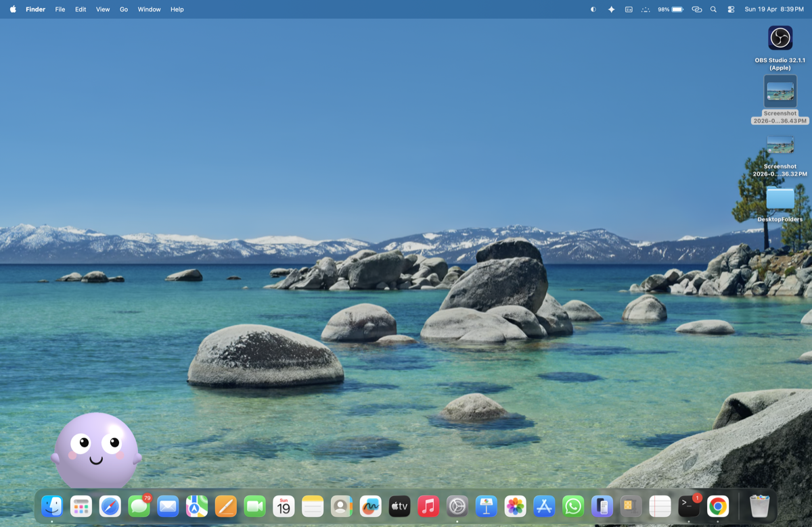

# 🐾 Momo — A Tiny macOS Desktop Pet


Momo is a little procedural creature that lives directly on your screen. It is designed to be lightweight, unobtrusive, and fun. Momo wanders around your desktop, blinks, follows your cursor, and even takes a nap when you leave it alone. 

Built natively with **Swift**, **AppKit**, and **SceneKit**. 

Instead of relying on heavy 3D `.usdz` or `.scn` models, Momo is drawn dynamically from procedural primitives, ensuring the entire app remains a single, incredibly small binary!

<div align="center">
  
</div>

---

## 📑 Table of Contents

- [🎮 Features & Interactions](#-features--interactions)
- [⚙️ Tech Stack](#-tech-stack)
- [🚀 Install & Quick Start](#-install--quick-start)
- [💖 Support](#-support)
- [🤝 Contributing](#-contributing)
- [📜 License](#-license)

---

## 🎮 Features & Interactions

Momo isn't just an idle application—it reacts to your workflow!

- **Idle Behavior**: Gentle breathing and occasional blinking.
- **Eye-Tracking**: Momo's pupils actively follow your cursor around the screen.
- **Wander Mode**: Automatically walks to a random new spot on your screen every ~30 seconds.
- **Click React**: Click on Momo to see it hop, squish, and widen its eyes in surprise.
- **Physics Drag**: Grab, drag, and toss Momo across the screen—it squishes realistically upon landing.
- **Sleep Cycle**: After 5 minutes of no cursor interaction, Momo will sit down and close its eyes.
- **Wake Up**: Moving your cursor near a sleeping Momo instantly wakes it up.
- **Speech Bubble**: Momo occasionally shares its thoughts with a tiny speech bubble.
- **Edge Aware**: Seamlessly detects screen boundaries to turn around and avoid falling off-screen.

---

## ⚙️ Tech Stack

- **Swift & AppKit**: Uses a transparent, borderless `NSWindow` that natively floats above all your other windows.
- **SceneKit**: A complete 3D scene built exclusively from mathematical procedural primitives. No asset loading means an ultra-low memory footprint.

---

## 🚀 Install & Quick Start

### Option A — Run from Source (Recommended)

Running from source is the easiest way to try Momo right now. Ensure you have Xcode command-line tools installed (`xcode-select --install`).

```bash
git clone https://github.com/RagavRida/momo-pet.git
cd momo-pet
swift run
```
> **Note**: To quit the app, look for the small lavender dot in your macOS menu bar!

### Option B — Download Pre-compiled Binary

1. Grab `MomoPet.app.zip` from the [Latest Release](https://github.com/RagavRida/momo-pet/releases).
2. Unzip the file and move `MomoPet.app` to your `/Applications` folder.
3. **First launch**: Right-click `MomoPet.app` → **Open** → click **Open** in the dialog.
   
*(macOS displays a warning because the app isn't signed with an Apple Developer ID yet. Right-clicking bypasses this requirement. Official application signing is on the roadmap—see [Support](#-support) if you'd like to help fund that!)*

---

## 💖 Support

Momo is free and open-source. If this little pet makes you smile, consider supporting its development:

- **UPI (India):** [](upi://pay?pa=ragavrida@okicici)
- **GitHub Sponsors:** Click the **"Sponsor"** button at the top of this repository!

**💸 Current Funding Goal:** ₹8,500 to cover an Apple Developer account, allowing for a signed, one-click-install build without macOS security warnings.

---

## 🤝 Contributing

Issues and Pull Requests are incredibly welcome. If you want to contribute, here are some great first issues:

- ✨ New idle animations or reactions
- 🎨 Extra pet skins and color variants
- 🔊 Sound effects (opt-in via menu)
- 🖥 Multi-monitor boundary polish

> **Pro Tip:** Please open an issue before making large architectural changes so we can align on direction!

---

## 📜 License

Distributed under the MIT License. See [LICENSE](LICENSE) for more information.

---
<div align="center">
Made with ❤️ by RagavRida
</div>
